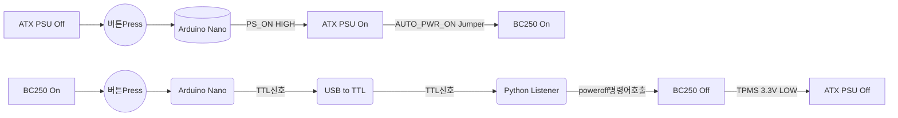
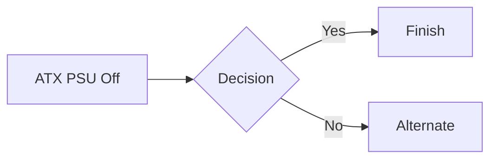

# Arduino Nano를 이용한 BC250 ATX-PowerSupply제어

BC250채굴기에 ATX PowerSupply를 사용하는경우 PCIE 8핀 전원만 연결되므로 PSU의 전원을 스스로 끌수없어 Arduino Nano를 이용하여 이를 제어하도록 제작

## 제작목표
* 가장 적은 비용
  * Arduino Nano는 알리에서 호환제품을 3000원정도에 구매가능하며 별도의 프로그램머나 디버거가 필요없음
  * Nano에서 BC250으로 종료신호를 보내기 위해 별도의 USB to ttl모듈이 필요함
* 가장 간단한 구조
  * BC250본체에 납땜작업이 없도록 구성
  * 만능기판이나 Nano외 추가적이 회로구성이 불필요하게 구성
   > BC250이나 아두이노는 회로상 모두 ATX PSU의 GND를 공유함, 그래서 전위차가 없으니 옵토커플러나 릴레이를 이용한 ATX P_ON 및 TPMS 절연은 오버스펙같음.
옵토커플러나 릴레이를 추가하여 회로를 구성하려면 회로가 복잡해지고 만능기판같은 추가자재가 필요해져 기구제작이 복잡해짐.

## 구현기능
* ATX PSU Off상태에서 Button Press -> ATX PSU On -> BC250 On
  * BC250은 자동전원On상태로 점퍼적용
* ATX PSU On(BC250 On)상태에서 Button Press -> BC250 Off -> ATX PSU Off
  * BC250의 Linux에서 Serical Port Listeng프로그램([serial_listener.py](https://github.com/coolsolgit/BC250-ATX-PSU-Control/blob/main/serial_listener.py)) 실행필요
  * BC250의 TPMS 3.3V Standby전원을 Nano에 연결하여 AliveCheck Source로 사용
* ATX PSU On 상태에서 4초간 Button Press(**강제종료**) -> ATX PSU Off






## 결선
ATX PSU의 5V Standby(상시)

TPMS 3.3V Standby
> TPMS 헤더에 듀퐁케이블로 연결(일반점퍼 규격보다 작은 PC메인보드의 USB3.0커넥터와 같은 2.0mm의 작은Pitch)

ATX PSU의 PS_ON

버튼 및 버튼LED
> 버튼LED의 전압에 맞는 PSU에서 뽑아서 사용

## Serial port listener적용
CachyOS기준으로 설명

Pathon 및 Sereial Lib설치
```
sudo pacman -Syu
sudo pacman -S python
python --version
sudo pacman -S python-pyserial
```

파이썬코드가 권한없이 poweroff호출가능하도록 권한편집
```
sudo nano /etc/sudoers
```
맨아래줄추가
```
username ALL=(ALL) NOPASSWD: /usr/bin/systemctl poweroff, /usr/bin/shutdown
```

자동실행

crontab으로 등록
```
crontab -e
```
추가
```
@reboot /usr/bin/python3 /MY_PATH/serial_listener.py &
```

CachyOS는 crontab기본설치가 안되있음
```
sudo nano /etc/systemd/system/serial-listen.service
```
추가
```
[Unit]
Description=Shutdown signal monitor
After=network.target

[Service]
Type=simple
ExecStart=/usr/bin/python3 /MY_PATH/serial_listener.py
Restart=on-failure

[Install]
WantedBy=multi-user.target
```

## BOM

| 명칭  | 가격 | 구매링크 |
| ------------- |:-------------:|-------------|
| Arduino Nano| \3000 | ali link |
| USB to Ttl | \3000 | ali link |
| Debounce Button | \2000 | ali link |


Arduino에 연결된 버튼누름을 인식하여 ATX P_ON HIGH/LOW을 설정하여 PSU전원을 제어함.
BC250꺼질시 PSU연동은 BC250의 TMPS 3.3V Standby전원을 AliveCheck 소스로하여 이게 LOW면 ATX P_ON도 LOW로 변경

BC250이나 아두이노는 회로상 모두 ATX PSU의 GND를 공유함, 그래서 전위차가 없으니 옵토커플러나 릴레이를 이용한 ATX P_ON 및 TPMS 절연은 오버스펙같음.
옵토커플러나 릴레이를 추가하여 회로를 구성하려면 회로가 복잡해지고 만능기판같은 추가자재가 필요해져 기구제작이 복잡해짐.

최대한 단순하게 그냥 아두이노하고 스위치만 있으면 만들 수 있게 하고, BC250 기판에 납땜을 하지 않는것을 주안점으로 진행.

Arduino-BC250연결은 USB포트와 BC250 TPMS 점퍼에 듀퐁케이블로 연결(TPMS가 일반점퍼 규격보다 작음주의)

전원이 켜진상태에서 버튼을 누르면 BC250 시리얼포트로 종료신호를 보내고 Linux Python코드에서 이를 수신하면 Linux종료처리 구현함.

Arduino UNO/NANO에서는 SerialPort가 열리는 순간 Arduino가 Reset되도록 설계되어있음.
이러한 이유로 당초계확과는 별도의 USB to TTL 모듈을 장착해야 정상적인 ATX전원관리가 가능.
Nano에 캐피시터나 저항을 붙여서 Reset을 방지할수 있는 방법이 있다고 하나, 그냥 TTL모듈을 사서 연결하여 해결.
시리얼포트(USB to TTL)을 구매(알리 2500원)해서 BC250 USB포트에 장착하고
이쪽으로 nano:TX <-> usb_ttl:RX 및 양쪽 GND를 연결하니 정상동작함.
