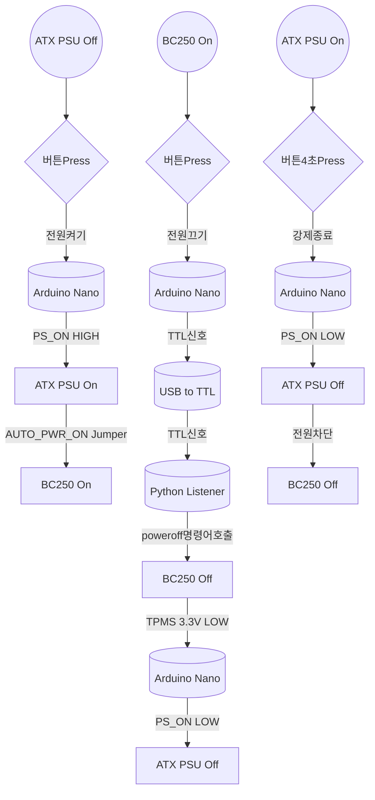
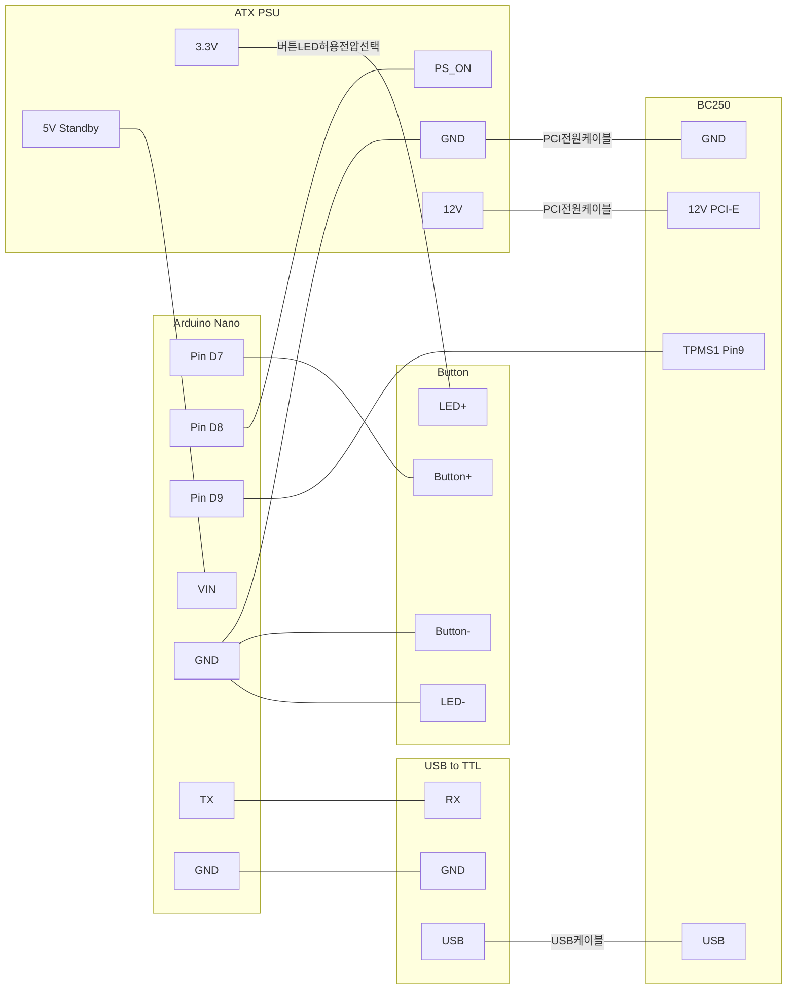

# Arduino Nano를 이용한 BC250 ATX-PowerSupply제어

BC250채굴기에 ATX PowerSupply를 사용하는경우 PCIE 8핀 전원만 연결되므로 PSU의 전원을 스스로 켜거나 끌수없어 Arduino Nano를 이용하여 이를 제어

Arduino Nano와 Arduino Uno는 구조가 동일하여 Uno를 보유하고 있다면 소스변경없이 Uno사용이 가능함

## 제작목표
* 가장 적은 비용
  * Arduino Nano는 알리에서 호환제품을 3400원정도에 구매가능하며 별도의 프로그래머나 디버거가 필요없음
  * Nano에서 BC250으로 종료신호를 보내기 위해 별도의 USB to ttl모듈이 필요함
      > Nano에 내장된 USB칩으로 TTL통신을 하려고 했으나 Arduino는 Serical통신이 시작되면 Reset되도록 설계된것을 나중에 알게되어 최초계획과는 다르게 추가비용(2000원)이 발생
* 가장 간단한 구조
  * BC250본체에는 납땜작업이 필요없음
  * 추가적인 전자소자나 회로기판이 불필요하게 구성
      > BC250이나 아두이노는 회로상 모두 ATX PSU의 GND를 공유함, 그래서 전위차가 없으니 옵토커플러나 릴레이를 이용한 ATX PS_ON 및 TPMS를 절연시키는것은 오버스펙같음

## 구현기능
* ATX PSU Off상태에서 버튼을 눌러 PSU와 BC250을 On
  * Arduino Nano는 ATX 5V상시전원에 연결
  * BC250은 AutoStart상태로 점퍼(AUTO_PWR_ON)적용
* BC250 On(ATX PSU On)상태에서 버튼을 눌러 PSU와 BC250을 Off
  * BC250의 Linux에서 Serical Port Listeng프로그램([serial_listener.py](https://github.com/coolsolgit/BC250-ATX-PSU-Control/blob/main/serial_listener.py)) 실행필요
  * BC250의 TPMS 3.3V전원을 Nano에 연결하여 AliveCheck Source로 사용
* ATX PSU On 상태에서 4초간 버튼을 눌러 강제로 PSU와 BC250을 Off




## 배선

TPMS 3.3V Standby
> TPMS 헤더에 듀퐁케이블로 연결(일반점퍼 규격보다 작은 PC메인보드의 USB3.0커넥터와 같은 2.0mm의 작은Pitch)

버튼 및 버튼LED
> 버튼LED의 허용전압에 맞는접압을 PSU에서 선택해서 사용



## Serial port listener적용
CachyOS기준으로 설명

### 1.Python 및 Sereial Lib설치
```
sudo pacman -Syu
sudo pacman -S python
python --version
sudo pacman -S python-pyserial
```

### 2.Python Listener소스파일 복사
[serial_listener.py](https://github.com/coolsolgit/BC250-ATX-PSU-Control/blob/main/serial_listener.py)를 다운로드 하여 원하는경로에 복사
> 후속 설명중 "MY_PATH"를 실제경로로 변경하세요

Linux에 등록된 USB장치의 ID를 확인하여 동일한 명칭으로 소스수정
> 보통 ttyACM0이거나 ttyUSB0로 인식됨
```
# 자신의 시스템에 인식된 tty device명으로 변경하세요.
# '/dev/ttyACM0', '/dev/ttyUSB0'등
ser = serial.Serial('/dev/ttyUSB0', 9600, timeout=1)
```

### 3.Python코드가 권한없이 poweroff호출가능하도록 권한편집
> Linux는 전원종료에 SuperUser권한이 필요하여 sudo명령없이 poweroff호출가능하도록 변경

권한편집시작
```
sudo nano /etc/sudoers
```
내용추가
```
username ALL=(ALL) NOPASSWD: /usr/bin/systemctl poweroff, /usr/bin/shutdown
```

### 4.자동실행

파일생성 및 편집
```
sudo nano /etc/systemd/system/serial-listen.service
```
내용추가
```
[Unit]
Description=Shutdown signal monitor
After=network.target

[Service]
Type=simple
ExecStart=/usr/bin/python3 /MY_PATH/serial_listener.py
Restart=on-failure

[Install]
WantedBy=multi-user.target
```

부팅시 자동실행등록
```
sudo systemctl daemon-reload
sudo systemctl enable serial-listen.service
sudo systemctl start serial-listen.service
```

### 5.crontab으로 자동실행하는경우(Optional)
> CachyOS는 기본으로 crontab이 설치되어 있지 않아 사전설치필요

crontab편집시작
```
crontab -e
```
추가
```
@reboot /usr/bin/python3 /MY_PATH/serial_listener.py &
```

## BOM
알리 알뜰마트나 Choice상품으로 구매하여 가격에서 배송비는 제외하였음   
버튼은 SelfReset, Momentary같은 유형(순간적으로 눌리고 다시 복원되는 형태)의 버튼을 구매해야 되며, 자신이 LED에 사용할 전압을 결정 후 선택
> 보통 3-6V, 12-24V 두가지로 판매됨

| 자재  | 가격 | 구매링크 |
| ------------- |:-------------:|-------------|
| Arduino Nano| 개당 3400원 | [알리link](https://ko.aliexpress.com/item/1005007392605300.html) |
| USB to TTL | 개당 1700원 | [알리link](https://ko.aliexpress.com/item/1005007718678768.html) |
| Momentary Button | 개당 2600원 | [알리link](https://ko.aliexpress.com/item/1005006477375437.html) |


